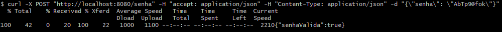
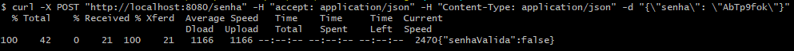

# Serviço para validação de senha

Esse projeto foi idealizado para realizar a validação de senha seguindo as definições.

- Nove ou mais caracteres
- Ao menos 1 dígito
- Ao menos 1 letra minúscula
- Ao menos 1 letra maiúscula
- Ao menos 1 caractere especial
  - Considere como especial os seguintes caracteres: !@#$%^&*()-+
- Não possuir caracteres repetidos dentro do conjunto
- Espaços em branco não devem ser considerados como caracteres válidos.

# Pré Requisitos
Para que seja possível rodar essa aplicação é necessário atender alguns requisitos.

- Java 11
- Maven 3

# Compilando e inicializando
É necessário primeiramente realizarmos a execução do Maven conforme o exemplo abaixo:
  
```bash
mvn clean install 
```
Certifique-se de que o repositório do Maven está corretamente configurado.

Para inicializar a aplicação pela IDE execute a aplicação pela classe  `ChallengeApplication.java`

# Execução da API

Após a inicialização do projeto é possível utilizar a API pela URL: 

```bash
http://localhost:8080/senha
```
Para realizar a validação da senha é necessário executar um **POST**, o corpo da requisição deve conter a senha que será validada, a requisição deve estar no formato json conforme exemplo abaixo.

**Exemplo Resquet:**

```
{
  "senha" : "AbTp9@fok"
}
```

**Exemplo Response:**

```
{
  "senhaValida": true
}
```

Podemos executar essa requisição pelo prompt de comando ou utilizar algum aplicativo como o Postman.

```bash
curl -X POST "http://localhost:8080/senha" -H "accept: application/json" -H "Content-Type: application/json" -d "{\"senha\": \"AbTp9@fok\"}"

```




# Desenvolvimento da API

Após entender qual era a ideia do desafio a primeira coisa foi definir como realizaria a validação da senha, o método escolhido foi através de expressões regulares por ser uma forma mais simples de validar e identificar caracteres.

A API  foi estruturada da seguinte maneira:

#### Controller

 **SenhaController** é responsável por tratar as requisições da aplicação.

Caso a senha tenha sido validada com sucesso a API irá retornar ` HttpStatus.OK`


Caso a senha não seja válida a API retorna ` HttpStatus.UNAUTHORIZED`


Caso o cliente não informe uma senha a API retorna ` HttpStatus.BAD_REQUEST`


Caso ocorra algum erro  interno  não esperado pela API ` HttpStatus.INTERNAL_SERVER_ERROR`


#### Domain

 **SenhaResquet**  - representação dos parâmetros de entrada da API.

 **SenhaResponse** - representação dos parâmetros de saída da API.

**Obs:** Utilizei objetos para realizar a representação pois considero mais fácil realizar a evolução da API dessa forma por exemplo, hoje não temos uma mensagem que indique para o usuário em qual erro de validação a API pode estar parando, podemos adicionar um campo com essa mensagem no response.

```
{
  "senhaValida": false ,
  "mensagem" : "A senha não pode  possuir caracteres repetidos"
}
```
#### Service

Tão importante quanto as regras de validação é a maneira como elas serão executadas, após definir que cada regra de validação seria executada separadamente foi definida a seguinte abordagem para esse aplicação, criei a classe **SenhaService** que ficou responsável por validar se a senha tem os requisitos mínimos "não ser nula ou vazia" e realizar a chamada das demais validações que implementam a interface **ValidarSenhaService**.

#### Validadores

Para uma melhor manutenção, evolução e testes da API as regras de validação foram separadas em 
classes diferentes, cada uma responsável por validar uma regra diferente de validação da senha de acordo com a sua respectiva expressão regular.

Caso seja necessário adicionar uma nova regra de validação basta criar uma nova classe implementando a interface **ValidarSenhaService** e sobrescrever o método **validar()** com a nova validação.

#### Exception

**ValidarSenhaException** utilizado para tratar as exceções da validação aplicação.

**SenhaException** utilizado para tratar as demais exceções da aplicação.

